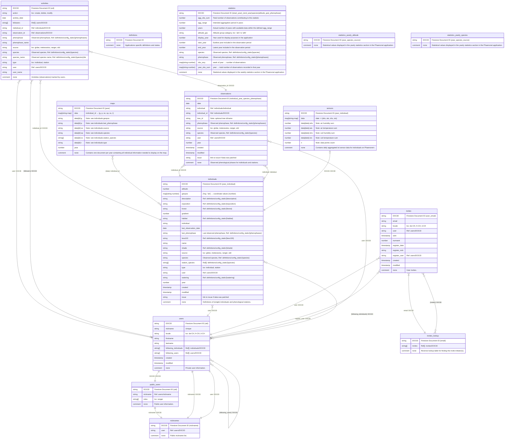

# PhaenoNet Datamodel

```mermaid

erDiagram
    activities {
        string DOCID "Firestore Document ID (uid)"
        string action "lov: create, delete, modify"
        date activity_date
        string[] followers "Ref[]: users/DOCID"
        string individual_id "Ref: individuals/DOCID"
        string observation_id "Ref: observations/DOCID"
        string phenophase "Observed phenophase, Ref: definitions/config_static/{phenophases}"
        string phenophase_name
        string source "lov: globe, meteoswiss, ranger, wld"
        string species "Observed species, Ref: definitions/config_static/{species}"
        string species_name "Observed species name, Ref: definitions/config_static/{species}/de"
        string type "lov: individual, station"
        string user "Ref: users/DOCID"
        string user_name
        comment none "Activities (observations) tracked by users."
    }

    users {
        string DOCID "Firestore Document ID (uid)"
        string nickname "Unique"
        string locale "lov: de-CH, fr-CH, it-CH"
        string firstname
        string lastname
        string[] following_individuals "Ref[]: individuals/DOCID"
        string[] following_users "Ref[]: users/DOCID"
        timestamp created
        timestamp modified
        comment none "Private user information."
    }

    individuals {
        string DOCID "Firestore Document ID (year_individual)"
        number altitude
        map[string-number] geopos "['lng', 'lat'] → coordinate values (number)"
        string description "Ref: definitions/config_static/{description}"
        string exposition "Ref: definitions/config_static/{exposition}"
        string forest "Ref: definitions/config_static/{forest}"
        number gradient
        string habitat "Ref: definitions/config_static/{habitat}"
        string individual
        date last_observation_date
        string last_phenophase "Last observed phenophase, Ref: definitions/config_static/{phenophases}"
        string less100 "Ref: definitions/config_static/{less100}"
        string name
        string shade "Ref: definitions/config_static/{shade}"
        string source "lov: globe, meteoswiss, ranger, wld"
        string species "Observed species, Ref: definitions/config_static/{species}"
        string[] station_species "Ref[]: definitions/config_static/{species}"
        string type "lov: individual, station"
        string user "Ref: users/DOCID"
        string watering "Ref: definitions/config_static/{watering}"
        number year
        timestamp created
        timestamp modified
        string issue "link to issue if data was patched"
        comment none "Definitions of (single) individuals and phenological stations."
    }

    observations {
        string DOCID "Firestore Document ID (individual_year_species_phenophase)"
        date date
        string individual "Ref: individuals/individual"
        string individual_id "Ref: individuals/DOCID"
        string tree_id "Note: optional tree id/name"
        string phenophase "Observed phenophase, Ref: definitions/config_static/{phenophases}"
        string source "lov: globe, meteoswiss, ranger, wld"
        string species "Observed species, Ref: definitions/config_static/{species}"
        string user "Ref: users/DOCID"
        number year
        timestamp created
        timestamp modified
        string issue "link to issue if data was patched"
        comment none "Observed phenological phases for individuals and stations."
    }

    nicknames {
        string DOCID "Firestore Document ID (nickname)"
        string user "Ref: users/DOCID"
        comment none "Public nickname list."
    }

    public_users {
        string DOCID "Firestore Document ID (uid)"
        string nickname "Ref: users/nickname"
        string[] roles "lov: ranger"
        comment none "Public user information."
    }

    invites {
        string DOCID "Firestore Document ID (user_email)"
        string email
        string locale "lov: de-CH, fr-CH, it-CH"
        string user "Ref: users/DOCID"
        timestamp sent
        number numsent
        timestamp register_date
        string register_nick
        string register_user "Ref: users/DOCID"
        timestamp created
        timestamp modified
        comment none "User invites."
    }

    invites_lookup {
        string DOCID "Firestore Document ID (email)"
        string[] invites "Ref[]: invites/DOCID"
        comment none "Reverse lookup table for finding the invite initiator(s)."
    }

    sensors {
        string DOCID "Firestore Document ID (year_individual)"
        map[string-map] data "date -> {ahs, ats, shs, sts}"
        number data[date]-ahs "Note: air humidity sum"
        number data[date]-ats "Note: air temperature sum"
        number data[date]-shs "Note: soil humidity sum"
        number data[date]-sts "Note: soil temperature sum"
        number n "Note: data points count"
        comment none "Contains daily aggregated iot sensor data for individuals on Phaenonet+."
    }

    maps {
        string DOCID "Firestore Document ID (year)"
        map[string-map] data "individual_id → {g, p, so, sp, ss, t}"
        string data[id]-g "Note: see individuals.geopos"
        string data[id]-p "Note: see individuals.last_phenophase"
        string data[id]-so "Note: see individuals.source"
        string data[id]-sp "Note: see individuals.species"
        string[] data[id]-ss "Note: see individuals.station_species"
        string data[id]-t "Note: see individuals.type"
        number year
        comment none "Contains one document per year containing all individual information needed to display on the map."
    }

    definitions {
        string DOCID "Firestore Document ID"
        comment none "Applications specific definitions and states."
    }

    statistics {
        string DOCID "Firestore Document ID ((start_year)_(end_year)_species_(altitude_grp)_phenophase)"
        number agg_obs_sum "Total number of observations contributing to this statistic"
        number agg_range "Intended aggregation period in years"
        number years "Actual number of years with available data within the defined agg_range"
        string altitude_grp "Altitude group category, lov: 'alt1' to 'alt5'"
        number display_year "Year used for display purposes in the application"
        number start_year "Earliest year included in the observation period"
        number end_year "Latest year included in the observation period"
        string species "Observed species, Ref: definitions/config_static/{species}"
        string phenophase "Observed phenophase, Ref: definitions/config_static/{phenophases}"
        map[string-number] obs_woy "week of year → number of observations"
        map[string-number] year_obs_sum "year → total number of observations recorded in that year"
        comment none "Statistical values displayed in the weekly statistics section in the Phaenonet application."
    }

    statistics_yearly_altitude {
        string DOCID "Firestore Document ID (year_species_source)"
        comment none "Statistical values displayed in the yearly statistics section in the Phaenonet application."
    }

    statistics_yearly_species {
        string DOCID "Firestore Document ID (year_species_source)"
        comment none "Statistical values displayed in the yearly statistics section in the Phaenonet application."
    }

    %% Relationships
    activities }o--|| individuals : "individual_id: DOCID"
    activities }o--|| observations : "observation_id: DOCID"
    activities }o--|| users : "user: DOCID"
    activities }o--|{ users : "[followers]: DOCID"
    individuals }|--|| users : "user: DOCID"
    invites }o--|| users : "user: DOCID"
    invites }o--o| users : "register_user: DOCID"
    invites }|--|| invites_lookup : "email: DOCID"
    invites_lookup }o--o{ invites : "[invites]: DOCID"
    maps }o--o{ individuals : "{data}: individual_id"
    nicknames ||--|| users : "user: DOCID"
    observations }o--|| individuals : "individual_id: DOCID"
    observations }o--|{ individuals : "individual: individual"
    observations }o--|| users : "user: DOCID"
    public_users ||--|| nicknames : "nickname: DOCID"
    sensors |o--|| individuals : "DOCID: DOCID"
    users ||--|| public_users : "DOCID: DOCID"
    users }o--o{ individuals : "[following_individuals]: DOCID"
    users }o--o{ users : "[following_users]: DOCID"
    users ||--|| nicknames : "nickname: DOCID"
```
