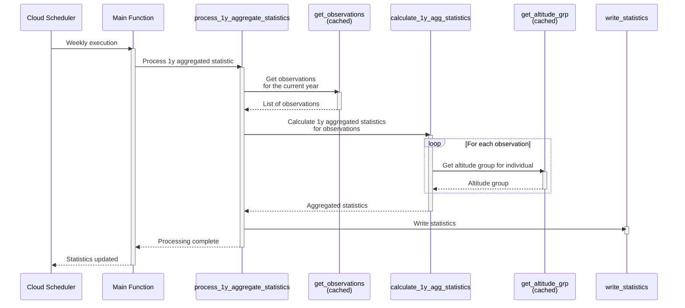
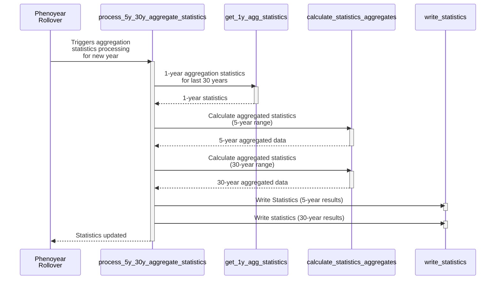
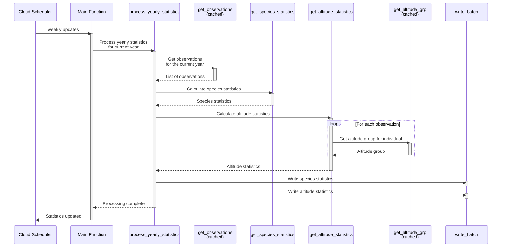

# Statistics Calculation

## Weekly Statistics

### Processing weekly statistics

```mermaid
sequenceDiagram
    participant Client as Cloud Scheduler
    participant Main as Main Function
    participant Process1y as process_1y_aggregate_statistics
    participant GetObs as get_observations<br/>(cached)
    participant Calc1y as calculate_1y_agg_statistics
    participant GetAlt as get_altitude_grp<br/>(cached)
    participant WriteStats as write_statistics
    Client->>Main: Weekly execution
    activate Main
    Main->>Process1y: Process 1y aggregated statistic
    activate Process1y
    Process1y->>GetObs: Get observations<br/>for the current year
    activate GetObs
    GetObs-->>Process1y: List of observations
    deactivate GetObs
    Process1y->>Calc1y: Calculate 1y aggregated statistics<br/>for observations
    activate Calc1y
    loop For each observation
        Calc1y->>GetAlt: Get altitude group for individual
        activate GetAlt
        GetAlt-->>Calc1y: Altitude group
        deactivate GetAlt
    end
    Calc1y-->>Process1y: Aggregated statistics
    deactivate Calc1y
    Process1y->>WriteStats: Write statistics
    activate WriteStats
    deactivate WriteStats
    Process1y-->>Main: Processing complete
    deactivate Process1y
    Main-->>Client: Statistics updated
    deactivate Main
```

### Process Aggregates on Phenoyear Rollover

```mermaid
sequenceDiagram
    participant Client as Phenoyear<br>Rollover
    participant ProcessAgg as process_5y_30y_aggregate_statistics
    participant Get1yStats as get_1y_agg_statistics
    participant CalcAgg as calculate_statistics_aggregates
    participant WriteStats as write_statistics

    Client->>ProcessAgg: Triggers aggregation<br/>statistics processing<br/>for new year
    activate ProcessAgg

    ProcessAgg->>Get1yStats: 1-year aggregation statistics<br/>for last 30 years
    activate Get1yStats

    Get1yStats-->>ProcessAgg: 1-year statistics
    deactivate Get1yStats

    ProcessAgg->>CalcAgg: Calculate aggregated statistics<br/>(5-year range)
    activate CalcAgg
    CalcAgg-->>ProcessAgg: 5-year aggregated data
    deactivate CalcAgg

    ProcessAgg->>CalcAgg: Calculate aggregated statistics<br/>(30-year range)
    activate CalcAgg
    CalcAgg-->>ProcessAgg: 30-year aggregated data
    deactivate CalcAgg

    ProcessAgg->>WriteStats: Write Statistics (5-year results)
    activate WriteStats
    deactivate WriteStats

    ProcessAgg->>WriteStats: Write statistics (30-year results)
    activate WriteStats
    deactivate WriteStats

    ProcessAgg-->>Client: Statistics updated
    deactivate ProcessAgg
```

## Yearly Statistics

### Processing yearly statistics

```mermaid
sequenceDiagram
    participant Client as Cloud Scheduler
    participant Main as Main Function
    participant ProcessYearly as process_yearly_statistics
    participant GetObs as get_observations<br/>(cached)
    participant GetSpecies as get_species_statistics
    participant GetAltitude as get_altitude_statistics
    participant GetAlt as get_altitude_grp<br/>(cached)
    participant WriteBatch as write_batch

    Client->>Main: weekly updates
    activate Main
    Main->>ProcessYearly: Process yearly statistics<br/>for current year
    activate ProcessYearly

    ProcessYearly->>GetObs: Get observations<br/>for the current year
    activate GetObs
    GetObs-->>ProcessYearly: List of observations
    deactivate GetObs

    ProcessYearly->>GetSpecies: Calculate species statistics
    activate GetSpecies
    GetSpecies-->>ProcessYearly: Species statistics
    deactivate GetSpecies

    ProcessYearly->>GetAltitude: Calculate altitude statistics
    activate GetAltitude
    loop For each observation
        GetAltitude->>GetAlt: Get altitude group for individual
        activate GetAlt
        GetAlt-->>GetAltitude: Altitude group
        deactivate GetAlt
    end
    GetAltitude-->>ProcessYearly: Altitude statistics
    deactivate GetAltitude

    ProcessYearly->>WriteBatch: Write species statistics
    activate WriteBatch
    deactivate WriteBatch

    ProcessYearly->>WriteBatch: Write altitude statistics
    activate WriteBatch
    deactivate WriteBatch

    ProcessYearly-->>Main: Processing complete
    deactivate ProcessYearly
    Main-->>Client: Statistics updated
    deactivate Main
```
